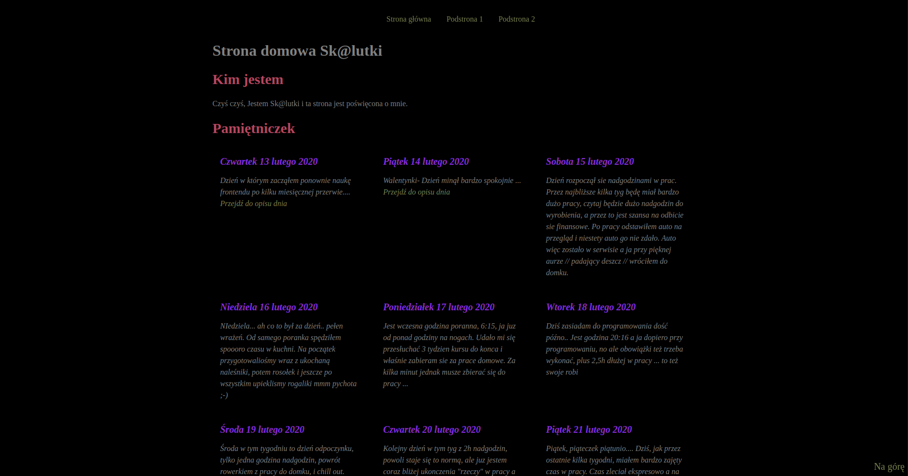

# Homepage skalutki

## **Feature:

- HTML 5
- CSS 3
- SASS
- BEM
- JS

## To run this webpage local:
1. `npm install -g gulp-cli`

2. `npm install`

3. `gulp`

To publish your page using github pages use `npm run deploy`
